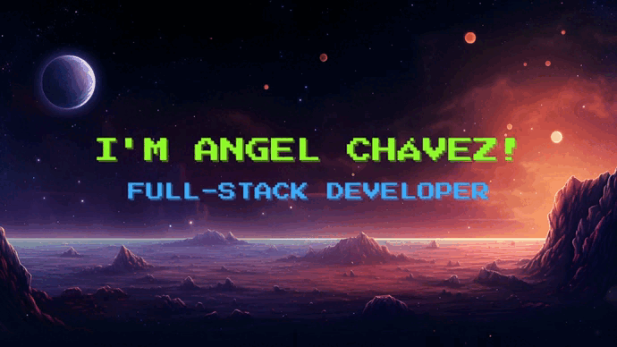

     &nbsp;
     &nbsp;
     &nbsp;

## 💡 A Quote:

## 💻 My Tech Stack:

## 🏆 My Stats:

    &nbsp;&nbsp;
    &nbsp;&nbsp;
  

    

## ⚡ My Projects:

### [Nuxt Auth Template](https://github.com/angelchavez19/nuxt-auth-template)

This is a template for authentication in Nuxt.

### [Nest Auth Template](https://github.com/angelchavez19/nest-auth-template)

This is a template for authentication in Nest.

### [Minimalist Clone of Google Drive](https://github.com/angelchavez19/google-drive-clone-v1)

A minimalist clone of Google Drive

### [Portfolio](https://github.com/angelchavez19/portfolio-freelance)

My portfolio

